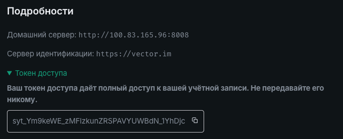

# Нагрузочное тестирование

**Выполнил:** Некрасов Богдан

## 1. Информация о целевом стенде

В ходе анализа были выявлены два адреса, ведущие на один и тот же физический сервер, но работающие на разных уровнях архитектуры:

* **Внешний сетевой контур (Прокси/Туннель):** `https://messenger-server.tail9da30d.ts.net/`
    * *Описание:* Защищенный HTTPS-адрес внутри приватной оверлейной сети **Tailscale** (домен `ts.net`). На данном этапе недоступен для прямой регистрации из внешней сети без активного VPN-клиента Tailnet.
* **Прямой внутренний адрес (Целевой):** `http://100.83.165.96:8008`
    * *Описание:* Прямой IP-адрес и порт Matrix-сервера (Synapse). Работает по протоколу **HTTP** (без шифрования) и принимает входящие подключения напрямую. **Именно этот адрес выбран в качестве основной цели для теста.**

---

## 2. Что было сделано

### Шаг 1: Проверка базовой конфигурации API

Был выполнен проверочный GET-запрос к конфигурационному эндпоинту сервера:

```bash
curl http://100.83.165.96:8008/.well-known/matrix/client
```

Сервер успешно вернул JSON-ответ, подтверждающий его интеграцию с внутренней структурой Tailscale:

```bash
{"m.homeserver":{"base_url":"https://messenger-server.tail9da30d.ts.net/"}}
```
### Шаг 2: Регистрация тестового пользователя

Используя прямое подключение http://100.83.165.96:8008, через официальный клиент Element была успешно проведена регистрация нового аккаунта.

- Имя пользователя (Логин): bodya

- Внутреннее имя сервера (Server Name): kirill417163 (сгенерировано сервером автоматически при установке)

- Полный Matrix ID: @bodya:kirill417163

### Шаг 3: Верификация сессии в интерфейсе

В разделе «Подробности» настроек клиента Element было успешно подтверждено, что текущая активная сессия пользователя bodya работает напрямую с целевым сервером по протоколу HTTP на порту 8008. Токен доступа (Access Token) успешно получен и готов к использованию для проверок "в лоб" через API.



### Шаг 4: Обоснование выбора эндпоинта для тестирования `/_matrix/client/v3/login`

Эндпоинт `/login` является тяжелым, потому что на проверку паролей сервер тратит огромное количество вычислительной мощности процессора

- Сервер не хранит пароли в открытом виде. Когда пользователь регистрируется, его пароль прогоняется через специальный алгоритм (например, bcrypt или argon2) и превращается в хэш. При каждом входе сервер обязан взять присланный пароль, заново запустить этот алгоритм, вычислить хэш и сравнить его с тем, что лежит в базе данных.

- Для одного пользователя задержка в доли секунды незаметна. Но когда утилита k6 начинает присылать сотни уникальных запросов в секунду, сервер оказывается вынужден одновременно запускать сотни этих тяжелых математических процедур. Процессор моментально загружается на 100%, очереди на обработку переполняются, из-за чего время ответа сервера вырастает до критических значений

### Шаг 5: Структура данных

Чтобы определить точную структуру данных, которую сервер ожидает получить при авторизаци, был выполнен перехват запроса через DevTools. 
Выяснилось, что сервер ожидает JSON со следующей структурой: 
```json
{
  "type": "m.login.password",
  "identifier": {
    "type": "m.id.user",
    "user": "bodya"
  },
  "password": "ПАРОЛЬ"
}
```

## Этапы тестрования

### Этап 1: Статическое тестирование утилитой hey (Неуспешная попытка)

#### Описание подхода

На первом этапе была предпринята попытка вызвать отказ в обслуживании (DoS) с помощью стандартного инструмента для генерации HTTP-нагрузки — `hey`.

Для этого использовался статический JSON-файл конфигурации `login.json`, содержащий данные одной конкретной учетной записи. Утилита циклически отправляла POST-запросы на эндпоинт авторизации: `/_matrix/client/v3/login`

#### Результат тестирования

Попытка вызвать деградацию системы завершилась неудачей. Сервер Matrix Synapse успешно справился со статическим потоком запросов.

Обнаружив аномально высокую частоту запросов на авторизацию под одной и той же учетной записью, сервер мгновенно перестал передавать эти запросы на тяжелую криптографическую обработку. Он начал автоматически возвращать легковесный `HTTP-ответ 429 Too Many Requests`

```bash
Status code distribution:
  [200]	12 responses
  [429]	10404 responses
```

### Этап 2: Выбор инструмента k6 и смена методологии

Для обхода встроенных механизмов Rate Limiting требовалось симулировать распределенную атаку, где каждый новый запрос выглядит для сервера уникальным.

Был разработан скрипт `load_test.js`, где Внутри функции запроса был настроен генератор случайных строк. Каждый отдельный POST-запрос содержал уникальное имя пользователя и случайный пароль.

### Этап 3: Итоги финального тестирования

Сценарий `k6` был запущен с интенсивностью 1 000 запросов в секунду с задействованием пула до 1 000 виртуальных пользователей (maxVUs: 1000). Общая продолжительность теста составила 2 минуты.

Финальные результаты:

```bash
TOTAL RESULTS 

    HTTP
    http_req_duration....: avg=1.61s min=62.79ms med=1.54s max=15.64s p(90)=2.07s p(95)=2.25s
    http_req_failed......: 100.00% 69324 out of 69324
    http_reqs............: 69324   572.95941/s

    EXECUTION
    dropped_iterations...: 50676   418.834618/s
    iteration_duration...: avg=1.62s min=112.8ms med=1.54s max=15.64s p(90)=2.08s p(95)=2.26s
    iterations...........: 69324   572.95941/s
    vus..................: 2       min=2              max=1000
    vus_max..............: 1000    min=581            max=1000

    NETWORK
    data_received........: 38 MB   316 kB/s
    data_sent............: 19 MB   158 kB/s
```

#### Анализ результатов

- **Объем трафика:** k6 отправил на сервер 19 МБ данных и успешно получил обратно 38 МБ ответов. Это подтверждает, что сетевой стек сервера оставался активен и обрабатывал сессии.

- **Процент ошибок (http_req_failed):** 100.00% (все 69 324 выполненных запроса были отклонены сервером с кодами ошибок).

- **Задержка ответа (http_req_duration):** Среднее время обработки одного запроса авторизации выросло до 1.61 секунды при норме в 64мс. В пиковые моменты задержка достигала 15.64 секунд.

- **Пропущенные итерации (dropped_iterations):** k6 был вынужден сбросить 50 676 запланированных запросов, так как из-за высоких задержек сервера пул виртуальных пользователей (VUs) исчерпал свои лимиты. Из запланированных 1000 запросов в секунду сервер физически успевал принимать только ~573.

### Этап 4: Выводы

Параллельно с ходом стресс-теста проводилась проверка доступности сервера с клиента Element (уже авторизованная сессия). Клиент продолжал корректно обновлять чаты и отправлять сообщения без заметных задержек.

На основе собранных метрик сделаны следующие выводы:

- Динамическая генерация имен полностью обошла стандартные лимиты приложения. Из-за роста задержек (до 15.6 секунд) эндпоинт `/login` стал полностью непригоден для использования. В период проведения атаки ни один новый пользователь не смог бы войти в мессенджер из-за истечения таймаута ожидания.

- Полного падения сервера не произошло. Архитектура Matrix продемонстрировала высокую живучесть: запросы авторизованных пользователей (работающие через эндпоинт `/sync` с использованием `access_token`) обрабатываются в отдельном приоритетном пуле потоков и не блокируются криптографическими вычислениями, происходящими на этапе `/login`.